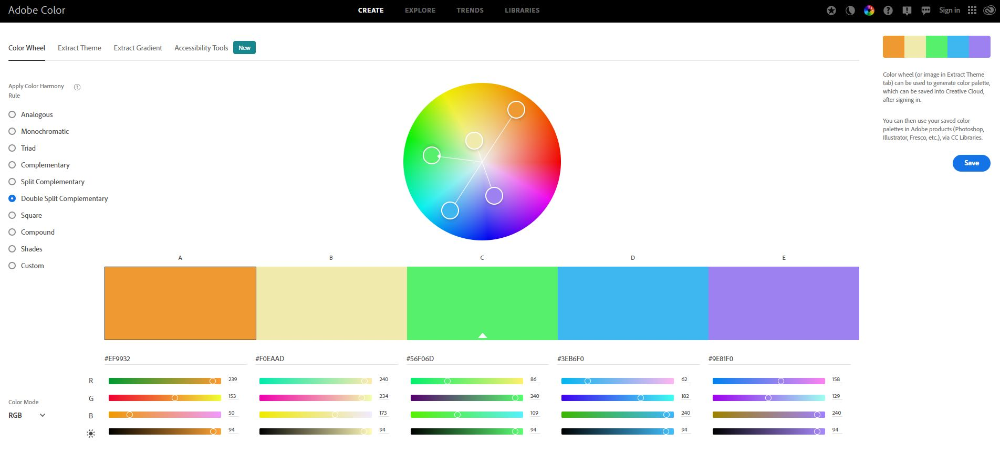

Usability Goals
===============

Recognize Exclusion and Solve for One, Extend to Many
-----------------------------------------------------

I would like to include alt tags on images on my site to allow for those who are visually impaired to have a description of an image, since they may not be able to see it or see it well. This would utilize the principle of inclusive design by recognizing an exclusion and addressing it. It could also be helpful to those who may not recognize the image by providing additional information about the image. This provides context and utilizes the principle to solve for one, extend to many. An example can be found at the link below where an image doesn't load, but the alt text provides context of what the image is supposed to display.

[Example](https://accessibility.huit.harvard.edu/sites/hwpi.harvard.edu/files/styles/os_files_medium/public/liaisons/files/alt_text_example.jpg?m=1584666266&itok=jMw68TdU)

Aesthetic and Minimalist Design
-------------------------------

I would also like to incorporate the heuristic of aesthetic and minimalist design. I want to take the complexity out of planning a trip as much as possible. There can be a ton of facets that need to be considered like events, transportation, lodging, food, cost, weather, and many others when planning a trip. I want a simple interface that helps the user get the basic information they need and make it easy to perform changes or modifications to those plans. I've found on nearly every trip I have taken that "expect the unexpected" to be true. Making modifications to the plan areas of the site should be easy for the user to complete, and with a minimalist design I think that can be accomplished.

I feel like the following website explains, with very basic concepts, how I want to implement this design.
[Minimalist Website Ideas](https://invigomedia.com/minimalistic-vs-busy-web-design/)

Color Scheme & Typography
=========================

Color Scheme
------------

RGB Values:
#EF9932
#F0EAAD
#56F06D
#3EB6F0
#9E81F0

I am choosing this color set as I want my website to be bright and vibrant. I am hoping this will bring a happy and relaxing feel to the website since travel planning a vacation or trip can be quite stressful. Pastel colors, psychologically, are supposed to be calming and peaceful. Three out of the five selections also happen to be my favorite colors. I enjoy orange, green, and blue.

Typography
----------

Arial
Courier New
Brush Script

I think I will end up using three fonts throughout my site. I plan to use Arial for headings and titles. Courier New will be used for most of my informational text on the site. Lastly, if I need some text to pop or stand out, I think I will use Brush Script. However, since Brush Script can be difficult to read, I will make sure it is used with larger font sizes. I plan to implement text hierarchy with a headline or title, subheads, and text. I plan to utilize font size for attention and highlighting important subjects or areas.