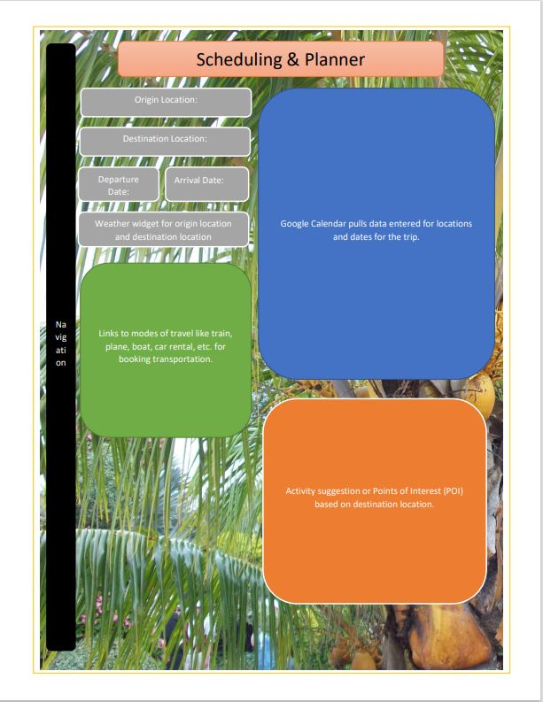
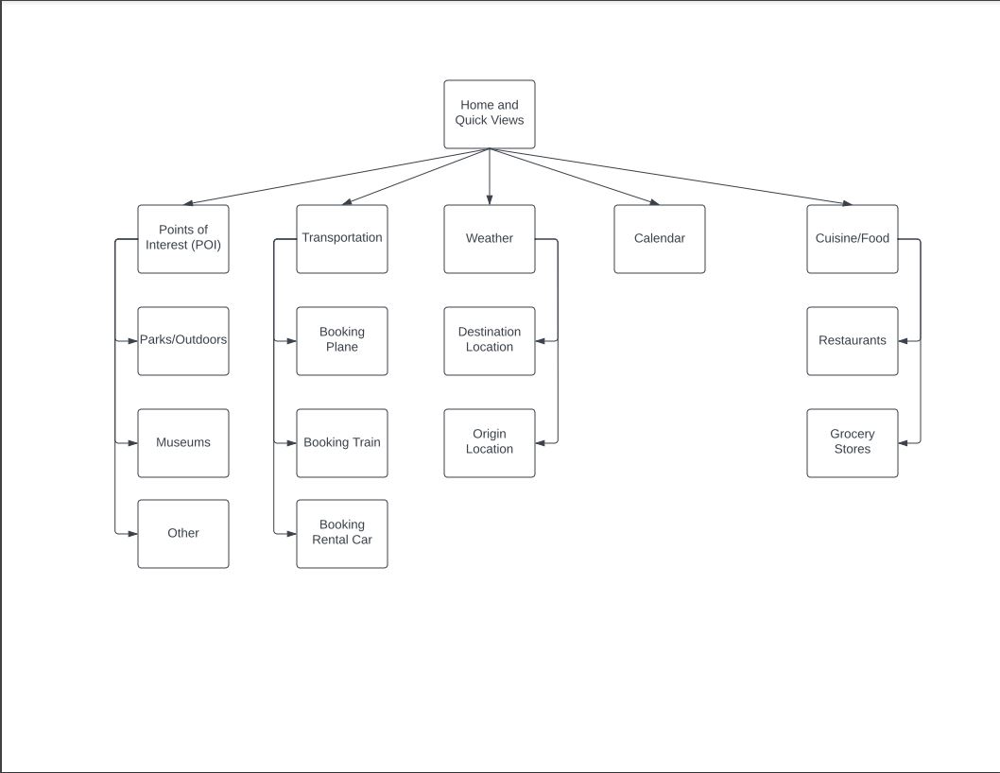

Plan to Travel with Me!
=======================

I want to create a travel planning website. I'd like to include the weather at both the departure location and the arrival location. I also want to have a calendar for checking on planned events during the trip, as well as deletion and modification of those events based on the weather. Lastly, I would like to have something that either suggests or provides POI or Points of Interest possibly based on location. If there is time it would be fun to add in food/restaurant suggestions as well as grocery store locations to help the traveler save money.

Web Services
------------
[Google Calendar](https://developers.google.com/calendar) OAuth2.0

1. [Get](https://developers.google.com/calendar/api/v3/reference/events/get)
2. [Insert](https://developers.google.com/calendar/api/v3/reference/events/insert)
3. [Update](https://developers.google.com/calendar/api/v3/reference/events/update)

[QWeather](https://dev.qweather.com/en/) APIKey

1. [Get 3 day forecast](https://dev.qweather.com/en/docs/api/weather/weather-daily-forecast/#request-url)

[Recreation Information Database](https://ridb.recreation.gov/landing) APIKey

1. [Get/events](https://ridb.recreation.gov/docs#/Activities/getActivities)
2. [Get/Activities](https://ridb.recreation.gov/docs#/Events/getEvents)
3. [GET/facilities](https://ridb.recreation.gov/docs#/Facilities/getFacilities)

Database Use
----------

I plan to have an events table to store planned activities like biking, kayaking, or fishing. Another table I would like to have, or use is a table called day. I plan to be able to store events and link them to a day in a many(events)to many(days) or one(day) to many(events) types of relationship. I am thinking the database will need to store these events and days so that they can be communicated to the calendar API. Due to this, I will for sure need to read and write events.

Initial Designs
---------------

